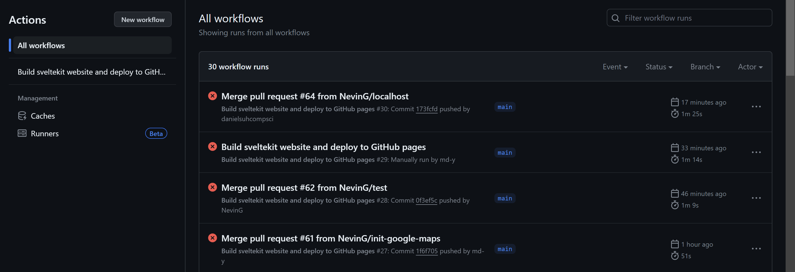
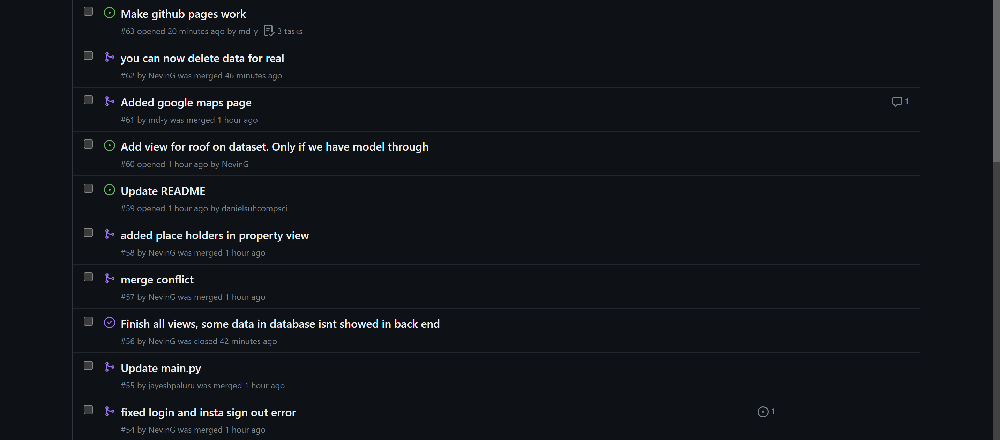
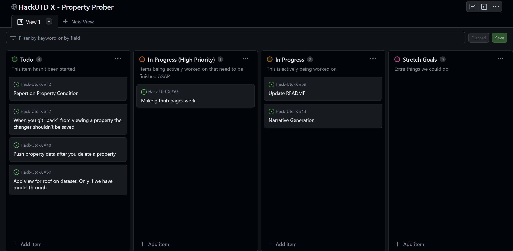

# Property Prober

## How we used GitHub

During development, we used three key GitHub features:

- [Actions & Pages](#actions)
- [Issues & Pull Requests](#issues--pull-requests)
- [Projects](#projects)

#### Actions

We used actions to automatically build the SvelteKit website and update GitHub Pages whenever we committed to main. This allowed us to instantly test our changes in production and to save time by not manually building. Futhermore, since GitHub pages supports custom domains, were are able to use it for a full deployment.

#### Issues & Pull Requests

We used issues to keep track of what we are working on and what we need to do. This made sure we don't forget to fix bugs or other issues as we are working. Issues also allowed us to assign tasks to other team members to help spread the workload. Pull requests also made sure that we did not commit changes to main that cause merge conflicts. Pull requests also allowed for large changes to be tracked and assigned to issues.

#### Projects

Alongside issues and pull requests, we used a GitHub project to keep track of the overall progress of the project. At the beginning of the project, we added all of the tasks that we needed to get done. As we worked through them, we updated each task's status to in progress and then done. We also kept track of new tasks as they came up and assigned them to team members using projects.

## Inspiration

## What it does

## How we built it

## Challenges we ran into

## Accomplishments that we're proud of

## What we learned

## What's next for PropertyProber
